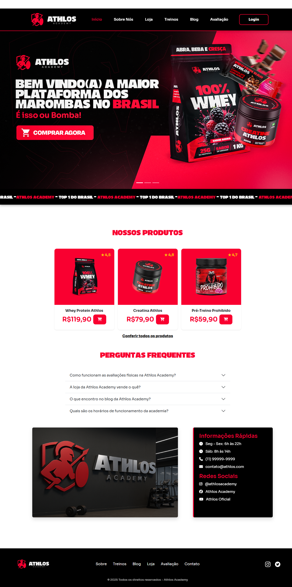
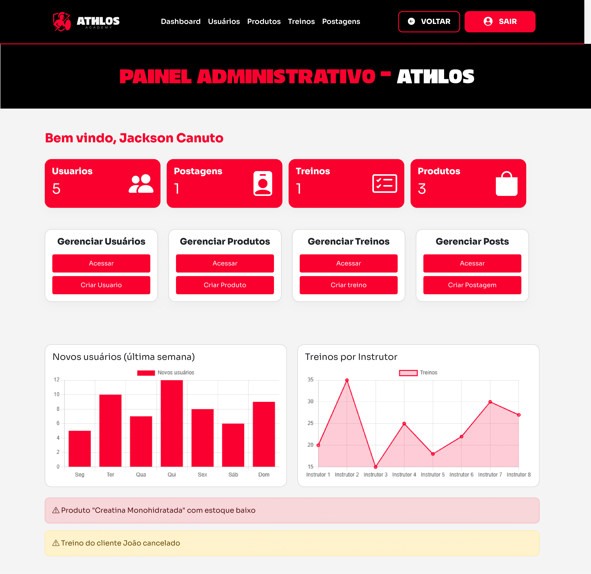
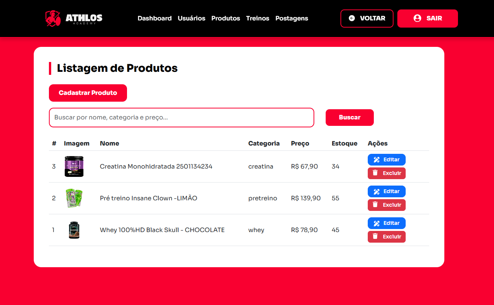
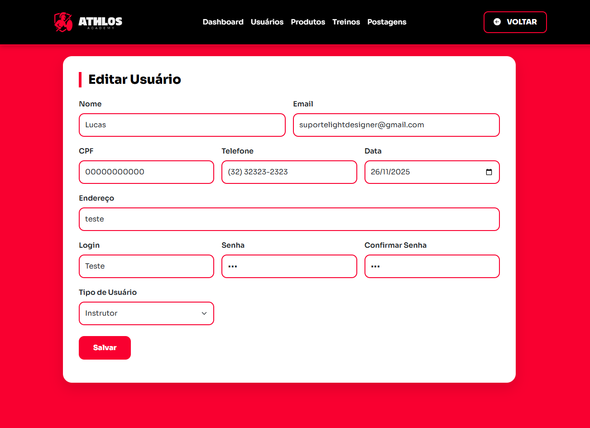

# Athlos Academy – Sistema Web de Gestão & E-commerce 

O **Athlos Academy** é um site institucional + e-commerce integrado com um sistema web desenvolvido para auxiliar academias, treinadores e alunos na organização, gerenciamento e acompanhamento de atividades esportivas, além de loja, blog e outras funcionalidades. O projeto foi criado no contexto da disciplina **Programação Web I (PWEB1)** do professor/orientador **Jackson Meires** portanto é um projeto de estudo e foi desenvolvido com foco em clareza, usabilidade e boas práticas. 

---

## 🚀 Funcionalidades Principais

- Cadastro e gestão de usuários (alunos, instrutores e administradores)  
- Autenticação e controle de permissões  
- Criação e organização de treinos e exercícios  
- Planos personalizados por aluno  
- Acompanhamento de desempenho e registros de progresso  
- Gestão de turmas, horários e aulas  
- Painel administrativo com métricas básicas  
- Interface responsiva e estilizada

---

## 🛠️ Tecnologias Utilizadas

- **HTML5**  
- **CSS3**  
- **JavaScript**  
- **PHP**   
- **Laragon**  
- **Git & GitHub**

---

## 📁 Estrutura do Projeto (exemplo)

```
/
│── css/               # Arquivos de estilo
│── img/               # Imagens e ícones (prints, logos, assets do sistema)
│── paginas/           # Páginas internas do sistema nas linguagem PHP & HTML+CSS
│── php/               # Scripts PHP (CRUD, conexões, autenticação e páginas do administrador)
│── admin/             # Área administrativa
│── sql/               # Arquivos exportados do banco
│── index.html         # Página inicial do front-end
│── README.md          # Documentação do repositório
│── style.css          # Estilo principal
```

---

## ▶️ Como Executar Localmente

1. Instale o **Laragon**
2. Copie o projeto para:  
   - `C:/laragon/www/` (Laragon)   
3. Inicie o Laragon e clique em Database
4. Abra o database e confira se o banco está lá
5. Após isso, configure o código no Visual Studio Code
6. Acesse no navegador: `http://localhost/PWEB_ATHLOSACADEMY/index.html`

> Observação: o GitHub Pages só serve sites estáticos. Parte PHP só funciona localmente ou em servidor com suporte PHP.

---

## 📸 Sugestão de Capturas de Tela

### TELA 1


**Descrição:** O index da parte institucional.

---

### TELA 2


**Descrição:** Parte da loja funcional abre somente mediante login no sistema para dados cadastrais.

---

### TELA 3


**Descrição:** Dashboard do sistema, possui informações e acessos as páginas do sistema administrativo.

---

### TELA 4


**Descrição:** Listagem dos produtos.

---

### TELA 5


**Descrição:** Criação/Edição de um Usuário.


---

## 👨‍💻 Dados e Autores

**Lucas Eduardo Dacroce** e **Erik Martins Gollo**
Professor/Orientador: Jackson Meires Canuto
Instituto Federal de Santa Catarina
CC: Programação Web I - 2025.2
Módulo: VII - Curso Técnico em Informática integrado ao Ensino Médio
GitHub: https://github.com/lightdsgn
